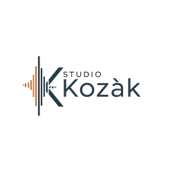
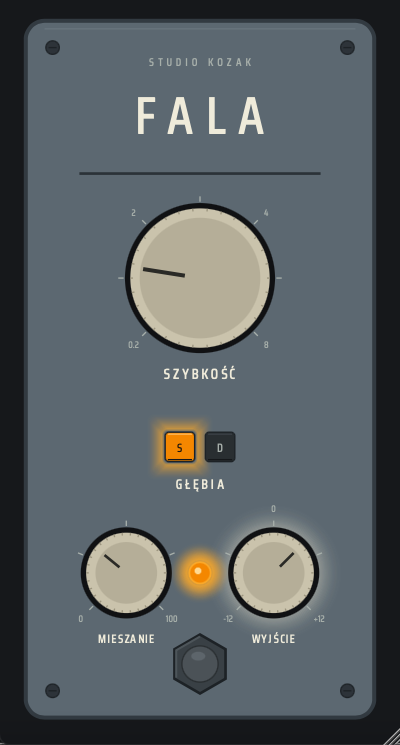

  

<h1 align="center">FALA</h1>

  <em>A chorus carried by the wave.</em>

  

  <strong>
    <a href="https://github.com/studiokozak/FALA/releases/latest">
      Download Latest Release
    </a>
  </strong>

---

## Overview

There is a story told in some parts of Poland.

Many years ago, a teenager with more curiosity than money wanted his guitar to sound bigger. Unable to afford the chorus pedals he saw in magazines, he spent his evenings in a small bedroom surrounded by old radios, broken cassette players and a soldering iron that had probably seen better days.
He wasn't trying to invent anything revolutionary. He simply wanted that sound, that strange sense of width and movement that seemed to make a guitar come alive.
Night after night, bits of salvaged electronics found their way onto a piece of perforated board. Components were swapped, wires were moved and more than a few experiments ended in disappointment. Some circuits produced nothing at all. Others produced noises that were interesting, but not particularly musical.

Then one evening, something happened.
A chord rang out and seemed to linger in the room a little longer than it should have. The sound felt wider, deeper and somehow larger than the small amplifier sitting in the corner. The circuit wasn't perfect. It drifted. It hissed a little. It never behaved exactly the same way twice.
That was precisely what made it special.

This is **FALA**.

Named after the Polish word for *wave*, FALA is a vintage-inspired BBD chorus that embraces the character of old analog modulation devices. Gentle instability, subtle saturation, clock imperfections and organic movement combine to create a chorus that feels alive rather than programmed.
It is not a laboratory recreation of any particular pedal.
It is a memory of one.

---

## Features

* Vintage-inspired BBD chorus character
* Deep and Shallow modulation modes
* Analog-style saturation
* Clock drift and modulation instability
* Wow & flutter simulation
* Dynamic noise floor behaviour
* Compander-inspired dynamics
* Low-frequency preservation
* Stereo modulation engine
* 4× oversampled processing
* VST3 (Windows & macOS)
* Audio Unit (macOS)
* Intel & Apple Silicon support

---

## Controls

### SZYBKOŚĆ (Rate)

Controls the speed of the modulation.
Slow settings provide gentle movement and width, while faster settings introduce a more obvious chorus effect.

---

### GŁĘBIA (Depth)

Selects between two modulation ranges.

**Shallow** offers subtle movement suitable for everyday widening.

**Deep** increases the modulation depth for a more dramatic and unmistakably vintage chorus character.

---

### MIESZANIE (Mix)

Blends the dry signal with the processed signal.
Lower settings provide a touch of movement, while higher settings place the chorus effect more prominently in the mix.

---

### WYJŚCIE (Output)

Adjusts the final output level after processing.
Useful for matching levels when comparing different settings.

---

### ZASILANIE (Power)

Engages or bypasses the effect.

---

## Philosophy

FALA was not designed to be perfect.

The modulation drifts.
The clock is not entirely stable.
There is a little noise.
A little movement.
A little unpredictability.

Just enough to remind you that music is made by humans, not oscilloscopes.
Many modern chorus effects aim for precision.
FALA aims for personality.
Turn a knob.
Play a chord.
Let the wave do the rest.

---

## Typical Applications

FALA may work particularly well on:

* Electric guitar
* Clean guitar arpeggios
* Bass guitar
* Synthesizer pads
* Electric piano
* Strings
* Background vocals
* Entire instrument buses

And occasionally on sources where it has absolutely no business sounding this good.

---

## System Requirements

### Windows

* Windows 10 or later
* VST3 compatible host
* VST3 format

### macOS

* macOS 11 Big Sur or later
* Intel or Apple Silicon
* VST3 and Audio Unit (AU) formats
* Compatible VST3 or Audio Unit host

---

## Installation

### Windows

Copy:

`FALA.vst3`

to:

`C:\Program Files\Common Files\VST3`

Then restart your DAW.

### macOS

#### VST3 Version

Copy:

`FALA.vst3`

to:

`/Library/Audio/Plug-Ins/VST3`

#### Audio Unit Version

Copy:

`FALA.component`

to:

`/Library/Audio/Plug-Ins/Components`

Then restart your DAW.

---

### macOS Security

FALA is built as a Universal Binary and supports both Intel and Apple Silicon Macs.
Depending on your macOS security settings, you may need to authorize the plugin manually the first time it is loaded.

---

## Notes

FALA is intended as a musical modulation effect, not a transparent stereo widener.
If you are looking for perfectly clean, mathematically precise chorus, there are many excellent options available.
FALA was built for those moments when a little instability makes the music more interesting.

Somewhere, perhaps, a teenager is still soldering wires together in a small bedroom.
This plugin is for him.

---

*Stéphan (Studio Kozak)*
